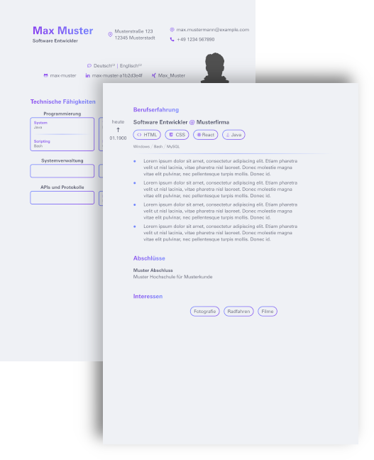

[](https://builtwithnix.org)

Quickly generate documents with a unified design with a simple command from any
machine. Contents and typeface are stored separately and styling is readonly.

<div align="center">
  
</div>

## Setup

```sh
git clone https://github.com/skarmux/typst-templates
cd typst-templates
```

[Install Typst](https://github.com/typst/typst/blob/main/README.md#installation)
or
```sh
# Use nix development shell
nix develop
```

```sh
# Automatically enter nix shell with direnv
direnv allow
```

## Usage

```sh
# Copy a template from /templates
cp templates/application_letter.toml ./my_application.toml
# Start editing its contents.
vim my_application.toml
# Generate the PDF document once you are done editing
./compile.sh my_application.toml
# The PDF will be stored in your current location
zathura my_application.pdf
```

## Customization

Fork this repository and make it your own.

- Delete any `skarmux` directories since those are for my personal use only.

- Copy and rename the `/typst/assets/placeholder` directory in place and start
  replacing the pre-existing files with your own. Name and file extension must
  be identical for now. You can then reference it by changing the assets source
  in your `.toml`: `assets = "<your-dirname>"`

- Change global styling rules by editing the typst modules in `/typst/modules`.

- You can alter any `.typ` file at will, but keep in mind that there are
  gotchas due to the implementation of `compile.sh`.

## Current gotchas

### TOML
- The comment in the first line of a `.toml` template is used to associate it
  with the corresponding `.typ` typeface.
- To not introduce arbitrary linebreaks in a multiline string of a `.toml` file,
  either activate linewrap in your editor or appond `\` at the end of a line to
  not add unwanted linebreaks in your final result.

### TYPST
- `#let data = ...` must be the very first line in a typst template.
- Relative paths must be prefixed with `./` as in `toml("./<path>")`.
