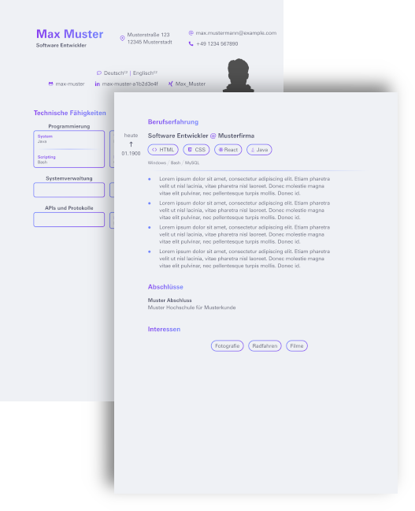

[](https://builtwithnix.org)

Quickly generate documents with a unified design with a simple command from any
machine. Contents and typeface are stored separately and styling is readonly.

<div align="center">
  
</div>

## Usage

```sh
nix run github:skarmux/typst-templates
```

You will be prompted for any missing configuration. Your selection will be parsed into
a JSON at the top of your TOML file. You can change it there with caution.
- `{ ..., "assets": "<path>" }` (Recommended) Set the absolute path to your own assets directory.

Your configured `$EDITOR` (and optionally a live preview) will open with a
TOML file where you can fill your data in.

The `data.toml` will reside in a temporary location under `/tmp` until you close the editor.
Once done, your changes `<filename>.toml` or `<template>.toml` will be stored at your current location.

If you pass a TOML file that one will be used:
`nix run github:skarmux/typst-templates -- <filename>.toml`

## TODO's

- [ ] Make the script run without nix commands by pulling the script out of the nix flake.
- [ ] Copy placeholder assets directory to current location for easier replacement of contents.
- [x] Allow renaming of generated PDF and data TOML.
- [ ] Automatically fill the date in meeting protocols.
- [ ] AI checking of written text.
- [ ] Digital signing of meeting protocols. (Each participant can sign with a FIDO key.)
- [ ] Coloring of graphics (svg, png, etc) in THEME color.
- [ ] Allow changing of primary and complementary colors.

## Acknowledgements

- Color scheme based on [Catppuccin](https://github.com/catppuccin/catppuccin), © 2021 Catppuccin. Licensed under the MIT License. See `licenses/CATPPUCCIN_LICENSE` for details.
- As well as the [cat footer graphic](https://github.com/catppuccin/catppuccin/blob/main/assets/footers/gray0_ctp_on_line.svg)
